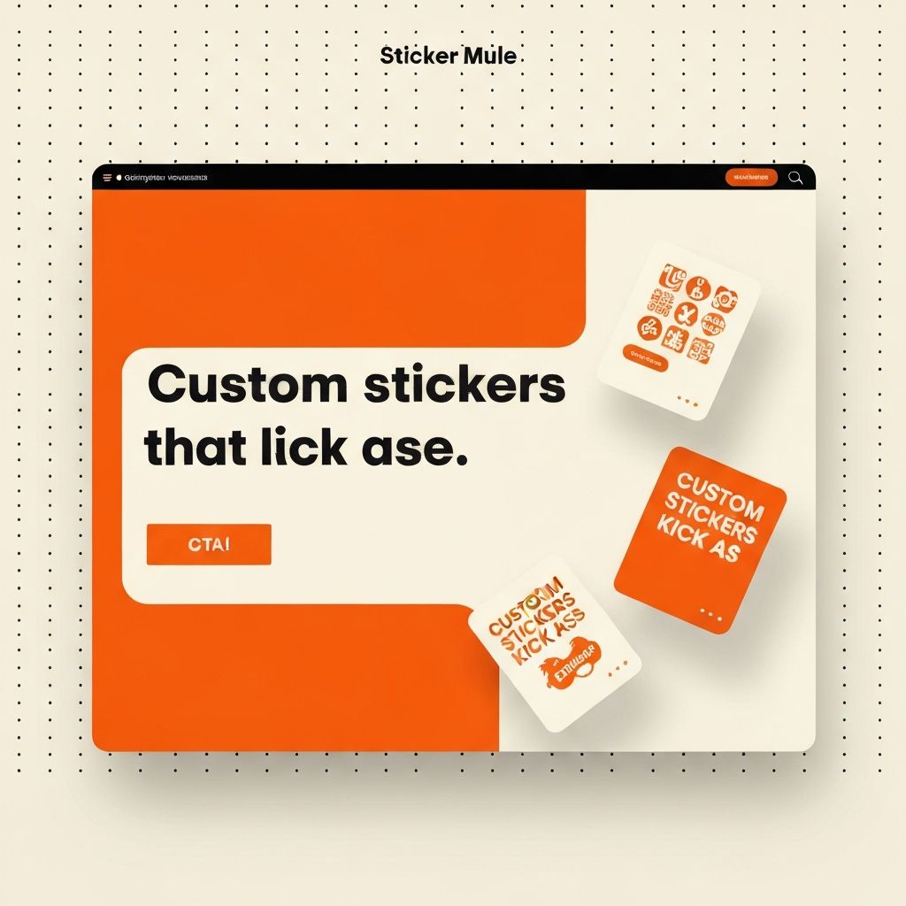
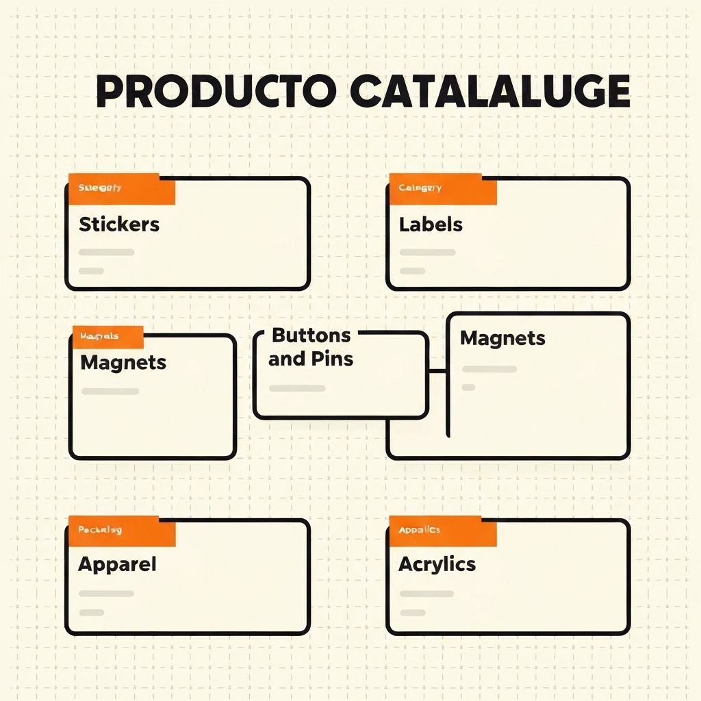
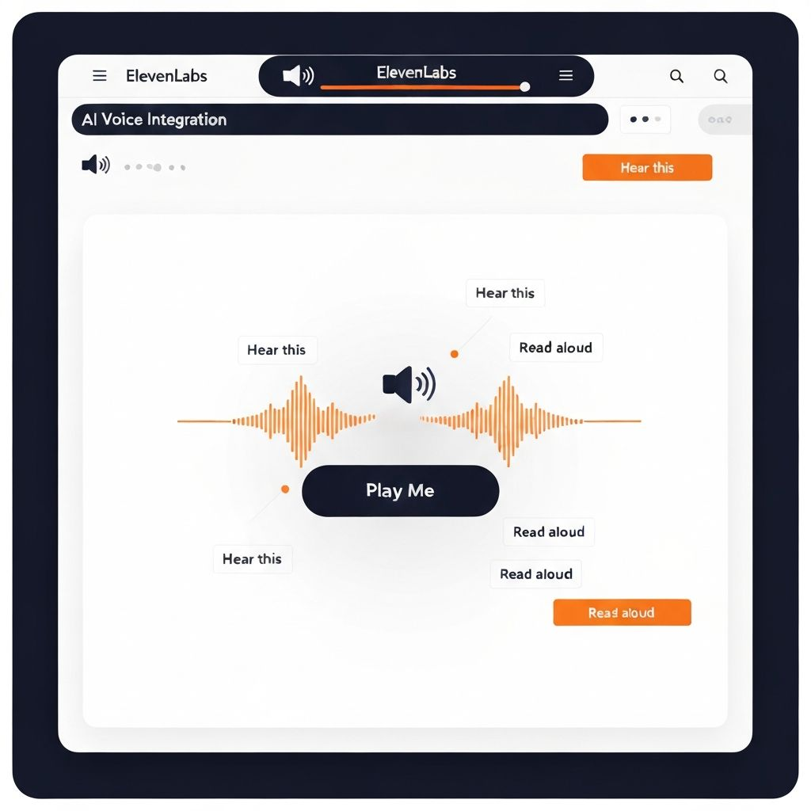
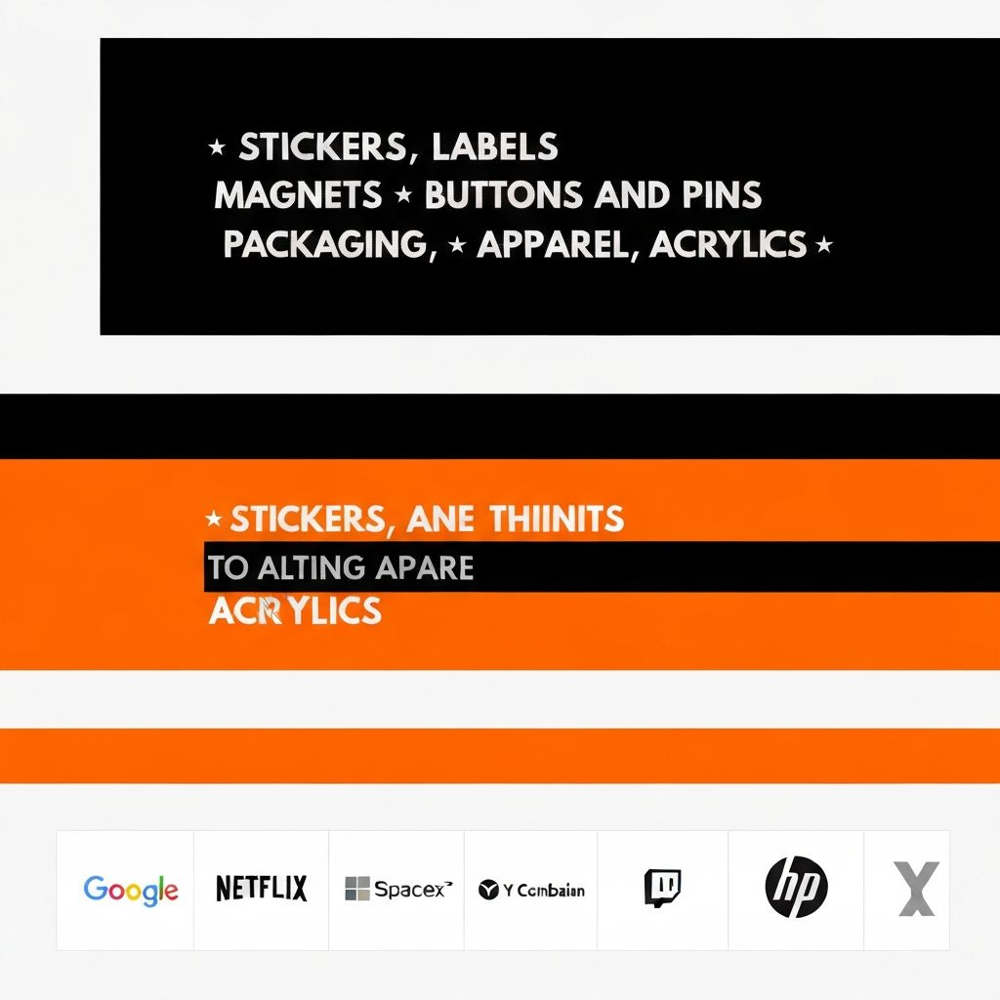
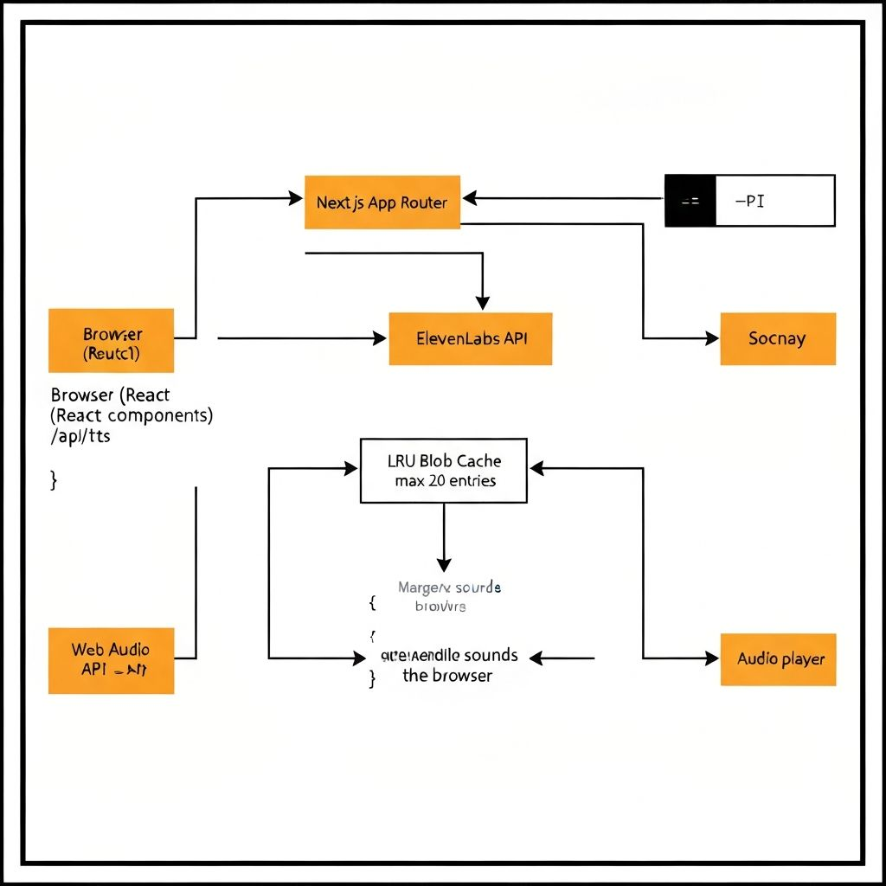

# Sticker Mule — Reimagined with v0 + ElevenLabs

> A complete visual redesign of the Sticker Mule product website, built with [v0](https://v0.app) and powered by [ElevenLabs](https://elevenlabs.io) TTS. Same product. Completely different aesthetic. Every product you can touch has a voice.

**Hackathon:** ElevenHacks x v0 &nbsp;|

---

## Preview



---

## What Was Built

This project clones [stickermule.com](https://www.stickermule.com) and reimagines it in a **Neubrutalist** visual aesthetic — bold 2px black borders, hard 4px offset box-shadows, dot-grid backgrounds, flat corners, and a newsprint-yellow ticker tape. The content and product catalogue are identical to the live site; only the design language is reinvented.

ElevenLabs Text-to-Speech is woven into the experience at every level — not as a novelty button, but as a first-class navigation layer. Every section, every product card, every customer review can be read aloud on demand.

---

## Screenshots

### Product Catalogue Grid



All seven Sticker Mule product families — **Stickers, Labels, Magnets, Buttons & Pins, Packaging, Apparel, and Acrylics** — are presented in an editorial bento grid with hard black borders and offset shadows. Each card plays a hover sound and reads its product description aloud via ElevenLabs when voice is enabled.

### ElevenLabs Audio Features



"Play Me" pill buttons appear throughout the page — next to the hero headline, in each product card, on every review, and on case study cards. A persistent audio control panel in the navbar lets users toggle voice on/off and adjust volume. When voice is enabled, hovering any card triggers an ElevenLabs narration of that product or review.

### Ticker Banner + Logo Carousel



A double scrolling ticker tape separates the hero from the logo carousel. The black strip lists all seven product categories; the orange strip lists key value propositions. Below it, 16+ brand logos (Google, Netflix, Microsoft, SpaceX, Twitch, Y Combinator, HP, Vercel, and more) scroll across three independent tracks at different speeds.

---

## Audio Architecture



```
Browser (React)
    │
    ├── Web Audio API ──────────► Synthetic SFX (no files needed)
    │       ├── createHoverSound()   — 15ms paper-flick transient
    │       ├── createClickSound()   — 40ms bandpass noise burst (rubber stamp)
    │       ├── createPeelSound()    — sawtooth pitch-drop (vinyl crinkle)
    │       └── createSuccessSound() — 3-note square-wave stab (C5 E5 G5)
    │
    └── AudioProvider (React Context)
            │  LRU Blob Cache (max 20 ObjectURLs, auto-revoke on evict)
            │  Exponential-backoff retry (2 attempts, 400ms / 800ms)
            │
            └── POST /api/tts  ──────────► ElevenLabs TTS API
                    { text, voiceId }              ↓
                                          audio/mpeg stream
                                                   ↓
                                          URL.createObjectURL()
                                                   ↓
                                          <audio>.play()
```

---

## Tech Stack

| Layer | Technology |
|---|---|
| Framework | Next.js 16 (App Router) |
| UI generation | [v0 by Vercel](https://v0.app) |
| Styling | Tailwind CSS v4 |
| Animation | Framer Motion |
| TTS / Voice | [ElevenLabs Text-to-Speech API](https://elevenlabs.io/docs/api-reference/text-to-speech) |
| SFX | Web Audio API (zero files, generated in-browser) |
| Fonts | Satoshi (display) + Inter (body) |

---

## ElevenLabs Integration

### API Used
- **Text-to-Speech** — `POST https://api.elevenlabs.io/v1/text-to-speech/:voice_id/stream`
- Streamed as `audio/mpeg`, converted to an `ObjectURL`, played via the native `<audio>` API

### Where ElevenLabs Appears

| Location | Trigger | Text spoken |
|---|---|---|
| Hero headline | "Hear our pitch" pill button | Full site elevator pitch |
| Hero stats | "Hear our stats" pill button | Key business metrics read aloud |
| Logo carousel | "Hear who trusts us" pill | All 16+ brand names |
| Product category cards | `onHoverStart` (when voice is on) | Product name, description, price |
| BestSellers cards | `onHoverStart` (when voice is on) | Product name, description, price |
| CTA section | "Hear this offer" pill | Full offer copy |
| Customer Stories hero | "Hear intro" pill | Page introduction |
| Customer Stories cards | "Play story" inline button | Brand name + headline + description |
| Pull quote | "Hear quote" pill | Full testimonial with attribution |
| Wall of Love hero | "Hear intro" pill | Page introduction |
| Wall of Love review cards | "Read aloud" inline button | Reviewer name, company, and full review text |

### Voice Control
- Toggle voice on/off via the speaker icon in the navbar
- Volume slider persisted to `localStorage`
- Separate `loading` and `speaking` states so the UI shows a spinner during network fetch and a pulsing ring during playback
- LRU cache (max 20 entries) with automatic `URL.revokeObjectURL` on eviction to prevent memory leaks
- Exponential-backoff retry (2 attempts at 400ms / 800ms) for transient API errors

---

## Product Catalogue

All seven Sticker Mule product families are integrated throughout the site:

| Product | Entry Points |
|---|---|
| **Stickers** — Die-cut, holographic, glitter, clear | Hero, TickerBanner, ProductCategories, BestSellers, Navbar |
| **Labels** — Waterproof custom product labels | TickerBanner, ProductCategories, BestSellers |
| **Magnets** — Full-color die-cut magnets | TickerBanner, ProductCategories, BestSellers |
| **Buttons & Pins** — Custom button badges | TickerBanner, ProductCategories, BestSellers |
| **Packaging** — Poly mailers, boxes, tape | TickerBanner, ProductCategories, BestSellers |
| **Apparel** — Tees, hoodies, hats | TickerBanner, ProductCategories, BestSellers |
| **Acrylics** — Keychains, standees, signs | TickerBanner, ProductCategories, BestSellers |

---

## Design System — Neubrutalist Layer

The neubrutalist aesthetic is implemented as a **purely additive CSS layer** — it does not override the base theme, only extends it via `.nb-*` utility classes:

```css
.nb-card          /* white card with 2px black border + 4px hard offset shadow */
.nb-card:hover    /* shadow grows to 6px, card lifts -2px/-2px */
.nb-btn           /* border-2 solid black, zero radius, hard shadow, press to collapse */
.nb-shadow        /* 4px 4px 0px #111 */
.nb-shadow-primary /* 4px 4px 0px var(--primary) */
.nb-tag           /* uppercase monospace label, black fill */
.nb-tag-primary   /* orange fill variant */
.nb-tag-cream     /* cream fill with black border */
.nb-dot-grid      /* radial-gradient dot texture (dark dots on light bg) */
.nb-dot-grid-light /* radial-gradient dot texture (light dots on dark bg) */
.ticker-tape      /* black scrolling ticker strip, font-mono, uppercase */
.ticker-tape-orange /* orange variant */
.nb-divider       /* 3px solid black full-width rule */
```

---

## Pages

| Route | Description |
|---|---|
| `/` | Homepage — Hero, Ticker, Logo Carousel, Product Categories, Value Cards, Best Sellers, Testimonials, Why Section, CTA |
| `/customers/stories` | Customer case studies with per-card ElevenLabs read-aloud |
| `/customers/wall-of-love` | Review grid with per-review ElevenLabs read-aloud |

---

## Getting Started

```bash
# Install dependencies
pnpm install

# Add your ElevenLabs API key
echo "ELEVENLABS_API_KEY=your_key_here" >> .env.local

# Start the dev server
pnpm dev
```

Open [http://localhost:3000](http://localhost:3000). Click the speaker icon in the top-right of the navbar to enable voice, then hover any product card or click any "Play Me" button.

### Environment Variables

| Variable | Required | Description |
|---|---|---|
| `ELEVENLABS_API_KEY` | Yes | Your ElevenLabs API key — get one at [elevenlabs.io](https://elevenlabs.io) |

---

## Project Links

- [Open in v0 →](https://v0.app/chat/projects/prj_eLoqdvIDMuMZOUIRAagXwd3Y0rFH)
- [Open in Kiro →](https://v0.app/chat/api/kiro/clone/vixclotet/v0-elevenhacks-x-v0)
- [ElevenLabs TTS Docs →](https://elevenlabs.io/docs/api-reference/text-to-speech)
- [v0 Documentation →](https://v0.app/docs)
